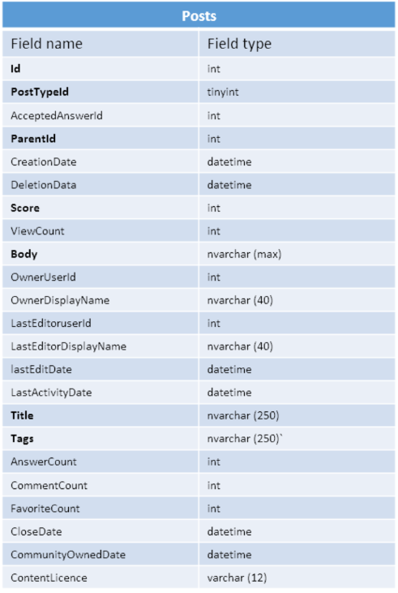

# Natural Language Processing Project

## StackOverflow Chatbot 

### Data Retrieval
The first step in developing the project was to retrieve the StackOverflow dataset in a Comma Separated Values (csv) format. The first resource I consulted was the Kaggle datasets, in which I found a dataset consisting of 10% of the StackOverflow questions and answers. After I analysed the dataset I realized that it was not fit for my purpose, mainly because the questions that I needed had to have a specific topic and format: in particular, the topic of the questions had to be on java arrays and the body of the questions had to be less than 150 characters. I put the constraint on the body in order to be able to avoid questions that could have too many information or references, so they could not be formulated with a simple (short) question. The main problem with the questions that had a large body is that they could contain code snippets or information that are mentioned in the answers, which makes the answers specific to that particular formulation and not generic enough for a different formulation of the question. The result I want to reach is to be able to reformulate the original questions, and still have a coherent answer. Another thing to mention is that usually, the users interact with the chatbots in a very short and concise manner, so the answer has to be as generic as possible.
With this in mind, I looked for other sources where I can find the needed data. The final choice was the SackExchange Data Explorer, which allows to query the StackOverflow database using SQL and download the result of the query as a csv file. This database contains several tables as shown in Figure 1 (left), but the one that I was interested in was the Posts table. The structure of the Posts table is presented in Figure 1 (right). The field names that are in bold, are the ones that were used for retrieving the questions and the answers used in the project. The table contains both the questions and the answers, in particular, the field PostTypeId identifies the question if it has a value of 1 and the answer if it has a value of 2. 
                         

First I retrieved the questions by using the following query:

`SELECT TOP 50000 Posts.Id, Title, Body FROM Posts
WHERE Posts.AnswerCount > 0 AND Posts.PostTypeId = 1
AND LEN(Posts.Tags) > 0 AND Posts.Tags LIKE ’%java%’
AND Posts.Tags LIKE ’%array%’AND not Posts.Tags LIKE ’%javascript%’ AND LEN(Posts.Body) < 150`
  
In the above query, we select 50000 rows that:
- have PostTypeId =1, which means that represents a question;
- have AnswerCount > 0, which means that have at least one answer;
- have LEN(Tags) > 10, which means that it has to have at least the number of characters contained by the words java and array. This will avoid getting questions that have only one of the two tags;
- have Tags LIKE '...', which means that the Tags column contains the specified word;
- have not Tags LIKE '...', which remove the rows that contain as tags the specified words. I had to add this because I also had results with javascript, and I wanted only java results;
- have LEN(Body) < 150, which means that the length of the Body column content is less than 150 characters. This constraint is explained above.

At this point I could retrieve the answers to the above questions. If we assume that the above query is called questions_query, then I used the following one to retrieve the answers:

`SELECT TOP 50000 Title, Posts.ParentId, Posts.ScoreFROM Posts 
JOIN questions_query ON Posts.ParentId = questions_query.Id`

The above query will retrieve all the answers that have as ParentId the same ones that are present in the questions that I retrieved with the questions_query. The ParentId field indicates the id of the question associated with a given answer.

### Data Preparation

In order to load and manipulate the data I used the python pandas library, and in particular the DataFrame structure. So the first step was to load each csv file in a DataFrame table, then I joined the two tables using the Id from the questions table, and the ParentId from the answers table. By joining the two tables, I associated each question with his answers. Since a question could have more than one answer, in the resulting table each question is repeated for every answer. To avoid this behaviour I used the groupby operator on the question Id and created for each question a list of answers that belong to that question. The problem with this approach is that it creates a list for each column of the question, so the title which is unique for each question is now represented by a list with only one element. I fix this by creating a method that substitutes the list in the title column with the element inside the list.

The text in the questions and the answers have an html format, so in order to be able to apply NLP tools on the text, I had to remove the html tags first. I did this using the following regular expression usage:

`re.sub(r'<(?!/code|code).*?>’, “”, text)`

The above regular expression remove all the strings that have the form <string_value> or </string_value>, with the exception of the <code> and </code>. The reason why I kept the <code></code> tags is that I have to remove all the code snippets from the text before the processing. In particular, if I have the following code snippet System.Out.Println, and apply on it sentence breaking, I will obtain the sentences System, Out, and Println, which is not the desired result. In this step I also removed all the extra newline characters using the following regular expression usage:

`re.sub(r'([\r\n]+|\r+|\n+)', '\n', text)`

### Mapping data to AIML format
To create the structure of the AIML, file, I used the python library xml, in particular, I used the minidom component. The first step was to create the root of the file, which is the <aiml></aiml> node. Then I loop through the questions, and for each question, I create a <category></category> element and append it to the AIML element. At this point, I had a few options on how to model the StackOverflow questions into the AIML pattern tag.
- The first one was to extract the keywords from the question title and replace all the words that don’t belong to the keywords list with an AIML placeholder. In this way the user has to match only the keywords in his question. I chose to use the “^” placeholder which could match 0 or more words.
- The second one was to apply POS Tagging on the question title and substitute not “essential” parts of the speech with placeholders. Some examples of parts of speech that I tried to substitute are determiners, adjectives, conjunctions, etc. Unfortunately, I didn’t find a general rule that indicates which part of speech can be removed and which not. What I discovered is that in some cases the adjectives can be removed because are not fundamental for formulating the question, but in other cases removing them would change the meaning of the question. So the results were not very promising.
- The third approach was to apply text summarization in order to obtain a shorter and concise question, but since the text of the questions title is quite short and synthetic the results were pretty poor. I also tried to combine the title and the body of the question, in order to have a longer text. In most cases, the summarized text had a non-clear meaning. I also have to mention that I used an extraction-based summarization method, which by default could give strange results from a grammatical point of view.
I think that the method that worked best was keyword extraction. The problem was that the tool I used to extract the keywords, which is nltk_rake, would not extract the words in the same order that were found in the text, so I had to reorder them to be able to create the question text. 

Once I had the keywords in the right order, I created the AIML pattern by inserting between the keywords the ^ placeholder, and this concludes the question creation process. Now I had to create the answers which are defined inside the template. So for each question I created a template element.  Since I want to provide to the user multiple responses for each question, in a random fashion, I created a random element inside each template. The idea is to insert as answers of the AIML questions all the StackOverflow answers, and to display one of them randomly. Now for each random element, I loop through the list of the answers to the associated question, and create an AIML li element for each of them.
Since I wanted to give a more human-like interaction, I had to split each answer into phrases and visualize each phrase with a given delay. The problem, in this case, was that the answers could contain code snippets, which as mentioned above will give some strange results in sentence breaking. So what I did was to save first the code snippets from the answer in an array and change them in the text with a placeholder in order to be able to insert them again after the sentence splitting. I isolated the code snippets in the text by using the following regular expression usage:

`re.sub(r'<code>((.|\n)*?)</code>', text)`

The placeholder that I used is $code_placeholder_i, where i was incremented by 1 at each new code snipped found.
I applied then the sentence splitting using the spacy library. For each phrase in the answer, I reinserted the code snippets and associated each phrase with the li element. Finally I inserted after each phrase a <delay></delay> element with a value of two seconds. The last step was to associate each li element with the correspondent random element.

Another thing that I did to improve the interaction with the bot, was to add at the end of each answer a question about how clear the answer was, and if the user would like to have another answer. The user could answer this question by clicking a Yes or No button. Here also I inserted multiple formats of the mentioned question that would be visualized in a random fashion. If the user chose the Yes button, which means that wants to have another answer to that question, I will visualize randomly one answer among the available ones for that question. If instead, it chooses No, I thank the user for the question, and inform him or her that it can ask another question. The last step was to format the AIML document and to save it on a file.

### Refining the chatbot
The last phase in the project was to give to the bot some general human-like interaction. I did this by implementing some categories that deal with the greetings, like asking the name of the user and remembering that name. I implement this by using AIML conditions. I declared a user variable that will store if the user already interacted with the bot or no.  So first I controlled if the greetings were made or not. If yes then I controlled if there is a user variable that has the user name in it. If yes then I simply ask the user to write his or her question, if not then I display a random message (among several) which asks the user to communicate his or her name. If the greetings where not made in the first place, I introduce myself (the bot) and ask the user to do the same. I create several patterns for the greetings on which I use the <srai></srai> feature of AIML in order to handle them with the same type of answers.

Next, I implemented the default pattern, in which I use a condition to see if greetings where made; if not I use srai to redirect to the greetings pattern explained above. If greetings where made, then I inform the user that I do not have an answer to his request, but I can ask to my StackOverflow friend, and present two Yes/No buttons, where I ask the user if he or she allows me to make the query. If the answer is yes then I use the <url></url> AIML feature to make a http request and provide the user with a button that will redirect him or her to the result of the query. After that, I provide the user with another Yes/No pattern where I ask if the resource was helpful. If the answer is No I ask if he or she wants me to ask to another friend (Google). If the answer is Yes then I make a query on Google. The interaction finishes either if the answer is Yes or No. If the answer to the first question (ask StackOverflow) is No then I present to the user a random answer chosen from different ones like: “Reformulate the question”, “I don’t know everything”, etc.

The last step was to manually control the questions and the answers in the AIML file to see if all of them make sense. Then I added for each question several alternative formulations and used the srai to give the same answer as the original question. I also had to add manually some basic questions which were not among the StackOverflow questions like “what is an array”, “how to declare an array”, etc. 

### Conclusions
The original idea for the project was to create all the process of transcription form StackOverflow format in AIML format in an automatic fashion, without any manual intervention. Unfortunately I realized that the text of the StackOverflow questions and answers is quite particular, so the tools that I had in mind to use for the transformation didn’t worked as well as expected. The main problem that I found is the presence of Java programming language code inside the text. Nevertheless the manual editing that I had to do was quite minimal, and the final result I think is quite good considering the very technical nature of the topic. Another thing that I have to mention is that the most of the answers consist in some minor discursive part, and a major part of code snippets. The AIML does not allow to format the code snippets in a proper way, since in a tool which is designed for a more colloquial interaction with the user.

### Running the chatbot
As already mentioned the tool for translating the StackOverflow questions and answers in AIML format was developed using Python programming language. In particular I used a Jupiter Notebook to write the required code. The source code is publicly available on GitHub. In order to run it, it has to be loaded in an environment which is able to run .ipynb files. The code will produce an AIML file which has to be manually controlled in order to be compiled by Padorabot without errors. The main issues that I found in the file were special characters that where present in the answers and that produced a bad syntax for the Pandora compiler. However in the submission I will provide a correct AIML file whose content can be copied and pasted to Pandorabot.

### References
[1]	Artificial Intelligence Markup Language (AIML) by Steve Worswick on Udemy: https://www.udemy.com/course/artificial-intelligence-markup-language/  
[2]	Kaggle StackOverflow Q & A: https://www.kaggle.com/stackoverflow/stacksample?select=Tags.csv  
[3]	AIML Documentation: http://www.aiml.foundation/doc.html  
[4]	Natural Language Processing (NLP) with Python — Tutorial: https://medium.com/towards-artificial-intelligence/natural-language-processing-nlp-with-python-tutorial-for-beginners-1f54e610a1a0#62b7  
[5]	Spacy tutorial: https://spacy.io/usage/spacy-101  
[6]	Natural Language Processing is Fun: https://medium.com/@ageitgey/natural-language-processing-is-fun-9a0bff37854e  
[7]	StackExchange Data Explorer: https://data.stackexchange.com/stackoverflow/query/edit/1340891  
[8]	Text Mining in Python: https://medium.com/towards-artificial-intelligence/text-mining-in-python-steps-and-examples-78b3f8fd913b  
[9]	Aulaweb resources: https://2020.aulaweb.unige.it/course/view.php?id=4298  

#### The questions implemented in the chatbot are the following ones:
 
1. How do I remove repeated elements from ArrayList?
2. How can I see if an element in an int array is empty?
3. Is there a Java array/list which is statically typed AND variable length?
4. Java sort String array of file names by their extension?
5. Do 2D arrays use more resources than 1D arrays in Java?
6. Removing an element from an Array (Java)?
7. Converting a Bidimensional Array (Numbers) Into A Dimensional Array and Viceversa on Java?
8. How to get the last value of an ArrayList?
9. Java array: direct access to component in array?
10. How to check whether the elements of an ArrayList are all contained in another ArrayList?
11. Java Iterate Bits in Byte Array?
12. Is it more efficient to remove elements from an ArrayList or a LinkedList?
13. Java: how to convert HashMap to array?
14. Using generics for arrays?
15. How do I declare and initialize an array in Java?
16. Convert InputStream to byte array in Java?
17. When is an ArrayList preferable to an array in Java?
18. How do I populate a JComboBox with an ArrayList?
19. Java: Copy array of non-primitive type?
20. Java ( Counting Distinct Integers )?
21. Java: function for arrays like PHP's join()?
22. Creating a byte[] from a List?
23. When to use a List over an Array in Java?
24. Final arraylist declaration?
25. What is the best way to combine several arrays into one single array?
26. list of 2D array in java?
27. Array of Dates in Java?
28. how will I find odd elements from two arrays?
29. In Java, why are arrays objects? Are there any specific reasons?
30. Java Arrays - What are they?
31. Convert Hash Map to 2D Array?
32. how to generate random number from array?
33. Java ArrayList Middle?
34. How to put a Scanner input into an array... for example a couple of numbers?
35. how to get HashTable values as Arraylist?
36. Free memory of a byte array in Java?
37. Do Java arrays have a maximum size?
38. Send an Array with an HTTP Get?
39. java array sorting?
40. Finding an element in an array in Java?
41. divide array into smaller parts?
42. java vector to arraylist?
43. How does ArrayList work?
44. Does initialized java array go onto stack or heap?
45. Best way to create singleton array?
46. What is the best way to remove the first element from an array?
47. How do you write a method that prints objects in a array in java?
48. Assigning an array to an ArrayList in Java?
49. How much data can a List can hold at the maximum?
50. 2D Array Question Java?
51. Possible to return a String array?
52. Java Scanner() to read from Array?
53. Efficient array elements un-ordering in Java?
54. Java array to multi dimensional?
55. Creating an Arraylist of Objects?
56. Converting 'ArrayList to 'String[]' in Java?
57. Can I add a group of ArrayList into a single ArrayList?
58. Maximum number of dimensions in a Java array?
59. How to read a file into a Java Bitmap?
60. can I copy an array to a hash table?
61. Copy 2 array in a new one?
62. How to convert a byte array to a string?
63. best way to convert an array of strings to a vector?
64. What is the different between a stackoverflow and arrayindexoutofbounds?
65. Java Array Destroy?
66. Why does Java allow arrays of size 0?
67. Memory Address of Array - Java?
68. In Java, do primitive types and arrays have a containing package?
69. Can you extend ArrayList in Java?
70. Java getting array keys?
71. Where is Java's Array indexOf?
72. Java: How to convert a String of Binary values to a Float and vice-versa?
73. How to store arrayList into an array in java?
74. Convert array of strings into a string in Java?
75. Converting from HashSet to String[]?
76. How does one convert a HashMap to a List in Java?
77. Converting char[] to byte[]?
78. ArrayList replace element if exists at a given index?
79. How to create an array of 20 random bytes?
80. How to convert a Java String to an ASCII byte array?
81. How can I convert a String to a char array?
82. Checking a column in 2-Dimensional Array?
83. Converting String array to java.util.List?
84. How can I get the unique elements of an unordered character array in Java?
85. Is there any use of making an array final (immutable) in Java?
86. How to use a char array in java if the size is unknown?
87. Write byte[] to File in Java?
88. What is a List vs. an ArrayList?
89. Java XML to Array?
90. Can Java use String as an index array key?
91. convert byte[] to Object File in Java?
92. How to read file bytes in Java?
93. Can you create a Java Iterator over a 2d array?
94. How to assign a value to byte array?
95. Java array declaration without hard coding the size?
96. How to convert int [] to Big Integer?
97. How do you avoid an ArrayList object from being modified, i.e. avoid adding and deleting its content?
98. Java - It's possible add an int and an String in the array?
99. Get mimetype from byte array without external lib?
100. How to escape ArrayIndexOutOfBoundsException?
101. How to create a list with specific size of elements?
102. Merge 3 arraylist to one?
103. Avoiding duplicate integers in an integer array?
104. How can I create an array of classes in Java?
105. Converting a double[] array into string[] array?
106. Java - adding elements to list while iterating over it?
107. Retrieving elemnts from an ArrayList by specifying the indexes?
108. Is it possible to initialize array in an interface?
109. Java: How to convert String[] to List or Set?
110. Optimal way to sort an array?
111. Convert String to array of integer in java?
112. Does the contains() method in Java ArrayList use binary search?
113. How to find the maximum value in an array?
114. Split the String into a String array?
115. compare int before its placed into an array?
116. Java Check Position of Array is not "" (Empty)?
117. Searching a list?
118. Java replacing char at index?
119. How to convert a Java 8 Stream to an Array?
120. Filling in a matrix in java?
121. Sorting an array of String based on the strings sizes (length)?
122. How can I define a method that can return the biggest variable in a array?
123. How to access an array thread safely in Java?
124. Printing elements from Nth index onward in an array?
125. How to add an Object into a certain x,y position in a 2D array of Objects?
126. Setting an array as an input parameter for a method?
127. Is there a way to see if certain integers are in certain places within an arraylist?
128. Why Array in Java always need to fixed size?
129. How to create 2d Array containing 2d Arraylist? (JAVA)?
130. How to declare a call a 2d array in java?
131. Can rows have different column count?
132. How do I return true if ArrayList is empty?
133. What is the base class for byte array?
134. to reverse the elements of an array?
135. How do I see if an array index I'm accessing is out of range of the array?
136. How to remove duplicated elements in a List?
137. JAVA 8 : How to initialize List Of List in one line?
138. How to write 2d arraylists in java?
139. Why can't we directly print Arrays in java?
140. Storing multiple objects in a single array element in Java?
141. how to create an array?
141. how to fill an array?
